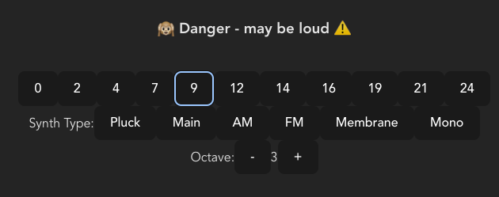

# tonejs-react-starter

A small react (typescript) app that lets you trigger pitches on tone.js with minimal fuss.

It's NOT meant to be very flexible and the starter for any tone.js project in React.



# install and run

```
yarn
yarn start
```
